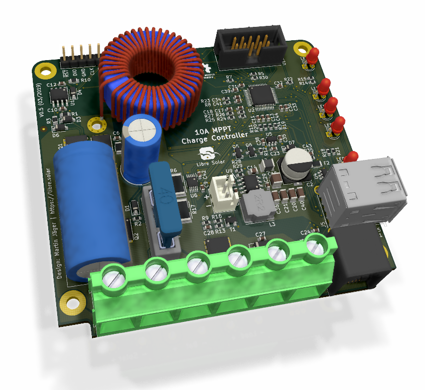

# 10A MPPT Charge Controller with USB

 Tested prototype, only minor issues left.

Schematic: [PDF file](mppt-10a.pdf) in repository

Gerber files: [PCB ordering](http://libre.solar/docs/pcb_ordering)  documentation

Bill of Materials: [BOM export](http://libre.solar/docs/bom) from KiCAD

## Features:
- 12V battery voltage
- 10A max. charge current
- 55V max. solar input
- Low-power 32bit ARM MCU (STM32L072)
- Expandable via Olimex Universal Extension Connector (UEXT) featuring
   I2C, Serial and SPI interface (e.g. used for display, WIFI communication, etc.)
- USB charging
- High-side load switching

## Built-in protection:
- Overvoltage
- Undervoltage
- Overcurrent
- PV short circuit
- PV reverse polarity (for max. module open circuit voltage of around 40V)
- Battery reverse polarity (destructive, fuse is blown)
