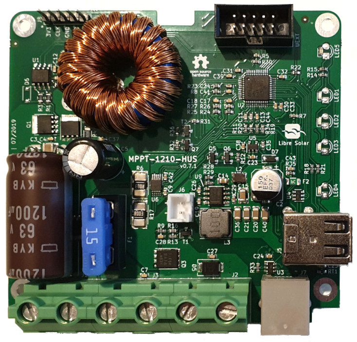

# 10A MPPT Charge Controller with USB

 Evaluation phase

User manual: [HTML](https://libre.solar/mppt-1210-hus/) / [PDF](https://libre.solar/mppt-1210-hus/manual.pdf)

Schematic: [PDF file](build/mppt-1210-hus_schematic.pdf)

Bill of Materials: [CSV file](build/mppt-1210-hus_bom.csv) or [interactive HTML BOM](https://libre.solar/mppt-1210-hus/mppt-1210-hus_ibom.html)

Firmware repository: [LibreSolar/charge-controller-firmware](https://github.com/LibreSolar/charge-controller-firmware)

## Features:

- 12V battery voltage
- 40V max. solar input (36 to 48-cell panels, ideally so-called 12V panels with 36 cells)
- 10A max. charge current
- 10A max. load output current
- Low-power 32bit ARM MCU (STM32L072)
- Expandable via Olimex Universal Extension Connector (UEXT) featuring
   I2C, Serial and SPI interface (e.g. used for display, WIFI communication, etc.)
- USB charging
- High-side load switching

## Built-in protection:

- Overvoltage
- Undervoltage
- Overcurrent
- PV short circuit
- PV reverse polarity
- Battery reverse polarity (destructive, fuse is blown)

## Manual

The manual is auto-generated from the markdown files in the `manual` subfolder. See [here](https://github.com/LibreSolar/md-manual-template) for further information regarding the automated deployment.

You can contribute to the manual by cloning the repository to your private GitHub workspace and sending pull-requests with upates you made.
